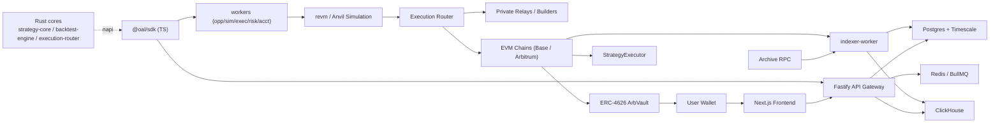

# On-Chain Arbitrage Lab

A research, backtesting and automated-execution platform for **on-chain arbitrage**. Funds live in non-custodial [ERC-4626](https://eips.ethereum.org/EIPS/eip-4626) vaults on-chain; opportunity discovery, path search, simulation and private bundle submission run off-chain. No CEX, no per-trade user signing, no "guaranteed returns".

> **Risk disclaimer.** Historical returns are not indicative of future results. Strategy targets are not guarantees. Smart-contract, MEV, liquidity and protocol risks may cause losses. Cross-chain strategies are not atomic arbitrage. See [`docs/risk-policy.md`](docs/risk-policy.md).

## What this is (and isn't)

- ✅ A platform to **research** arbitrage models, **backtest** them on historical block-level state, **simulate** executions on forks, and **run** them with small capital under explicit risk controls.
- ✅ Non-custodial vaults (ERC-4626) as the user fund entry point. Users only connect a wallet, approve, deposit, view and withdraw.
- ❌ **Not** a "guaranteed 20%+ yield product". Arbitrage profits are competed away; 20%+ is an internal out-of-sample admission gate, not a promise.
- ❌ **Not** audited production code. Pre-audit. See [`docs/risk-policy.md`](docs/risk-policy.md) and the completion matrix below.

## Architecture



See [`docs/architecture.md`](docs/architecture.md) for the full breakdown.

## Monorepo layout

| Path | Stack | Purpose |
|------|-------|---------|
| `crates/strategy-core` | Rust | DEX math (V2/V3/Curve/Balancer), negative-log graph search for cyclic arbitrage |
| `crates/backtest-engine` | Rust | Block-level replay, revm simulation, cost models, anti-overfit (walk-forward, capacity, cost-stress) |
| `crates/execution-router` | Rust | Tx construction, nonce/gas management, private-relay multiplexing |
| `crates/napi` | Rust→Node | napi-rs bridge exposing the cores to TypeScript |
| `contracts/` | Solidity / Foundry | `ArbVault`, `StrategyController`, `StrategyExecutor`, adapters, `RiskManager`, `Accounting`, timelock |
| `packages/config` | TS | Chain / asset / DEX-pool metadata |
| `packages/sdk` | TS | Shared types, API client, contract hooks, Rust-binding wrappers |
| `packages/ui` | TS | Shared React component library |
| `packages/strategy-models` | TS | Strategy models A/B/E (+ C/D/F/G placeholders) |
| `apps/api` | TS / Fastify | REST + SSE gateway |
| `apps/workers` | TS / BullMQ | 6 worker classes (indexer/opportunity/simulation/execution/risk/accounting) |
| `apps/web` | TS / Next.js | The product console (10 pages) |
| `infra/` | Docker / SQL | docker-compose, migrations, seeds, monitoring |

## Quick start

### 1. Install toolchains

Node 20+, pnpm, Rust, Foundry:

```bash
make setup
# or manually follow infra/scripts/setup-toolchain.sh
```

### 2. Start local databases

```bash
make db-up        # Postgres(+Timescale), Redis, ClickHouse
make db-migrate   # apply schema
make db-seed      # chains / assets / pools
```

### 3. Build the cores

```bash
make cargo-build  # Rust workspace
make forge-build  # Solidity
```

### 4. Run a local chain + deploy contracts

```bash
make anvil        # terminal 1: local EVM node
make deploy-local # terminal 2: deploy ArbVault + executors to Anvil
```

### 5. Run the apps

```bash
pnpm install
make dev-api      # terminal: API gateway :4000
make dev-workers  # terminal: workers
make dev-web      # terminal: Next.js :3000
```

Open http://localhost:3000.

## Configuration

Copy `.env.example` to `.env` and fill in your archive RPC endpoints (Base + Arbitrum), a deployer key, and DB credentials. See [`.env.example`](.env.example).

## Documentation

- [Design (full system spec)](docs/design.md)
- [Architecture](docs/architecture.md)
- [Strategy model interface](docs/model-interface.md)
- [Risk policy & kill-switch](docs/risk-policy.md)
- [Deployment & operations](docs/deployment.md)
- [API reference](docs/api-reference.md)

## Roadmap & completion matrix

This repository is a **pre-audit research/MVP build**. The table reflects honest completion per module.

| Area | Status |
|------|--------|
| Monorepo + toolchain | ✅ |
| Contracts (all 8 modules) + Foundry tests + Anvil demo | ✅ |
| Rust cores (strategy-core / backtest / execution) | ✅ |
| DB schema (Postgres/Timescale/ClickHouse) | ✅ |
| API gateway (REST + SSE) | ✅ |
| Workers (6 classes) | ✅ |
| Web console (10 pages) | ✅ |
| End-to-end backtest / vault / execution flows | ✅ (local Anvil) |
| Independent security audit | ⏳ future |
| Real profitability validation (14–30d live) | ⏳ future |
| Public testnet deployment | ⏳ future (needs your key + funds) |
| Real MEV-Share orderflow | ⏳ future |
| Cross-chain inventory (Model F), solver (Model C) | ⏳ phase 2/3 |

## License

MIT.
