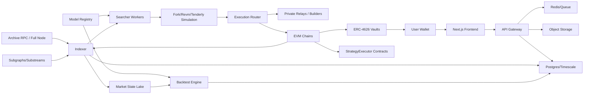

# 纯链上套利模型调研与系统设计方案

日期：2026-07-02

目标目录：`/home/bumblebee/Project/on-chain-arbitrage`

## 0. 结论先行

经过扩大范围搜索后，结论比较直接：

1. “用户无需注册交易所，只连接/授权链上钱包即可参与自动化套利”是可实现的。推荐形态不是让用户每次签交易，而是使用 ERC-4626 策略金库，用户通过钱包存入 USDC/ETH 等资产，合约持有资产并铸造份额，离线搜索器只负责发现机会、模拟、提交链上交易。也可以做智能账户 + session key，但第一版复杂度和安全风险更高。

2. “纯链上”必须定义清楚。资金、结算、持仓和审计可以 100% 在链上；机会发现、路径搜索、模拟、bundle 提交必须离线运行，否则 gas 成本和链上计算限制会让系统不可用。因此更准确的定义是“资金与交易执行纯链上，无 CEX，无用户交易所账户；搜索和风控由链下服务驱动”。

3. 目前确实存在可自动化的链上套利类别：DEX-DEX 原子套利、三角/循环套利、MEV backrun、清算套利、solver/intent 填单、跨链库存套利、LST/稳定币/LP 份额折价套利、收益率再平衡。但是没有可靠公开证据支持“稳定确保 20%+ 年化且不会过拟合”。越是明确的套利，越快被 MEV 搜索器、builder、solver 和专业做市商竞争压缩；越能长期 20%+ 的机会，通常包含尾部风险、合约风险、流动性风险、桥风险、治理风险或容量极小。

4. 所以产品设计应把 20%+ 作为“研究目标/上线准入门槛/容量约束下的历史与实盘滚动指标”，不能作为对用户承诺。前端、文档、合约事件和营销文案都应避免“保证收益”“稳定 20%”这类表达。

5. 推荐 MVP 是：先做单链或少数 L2 的原子 DEX 套利 + MEV-Share/backrun + LST/稳定币折价套利，配一套严肃回测和实盘小资金观测系统；跨链和 solver 策略作为二期。

## 1. 调研范围与主要资料

本次搜索覆盖了以下方向：

- Flash loan / flash swap：Aave V3、Balancer Vault、Uniswap V2/V3。
- MEV / backrun：Flashbots MEV-Share、simple-blind-arbitrage、mev-inspect、hindsight。
- Solver / intent：CoW Protocol solver competition、UniswapX filler/Dutch auction。
- 自动化执行：Chainlink Automation、Gelato Web3 Functions。
- DeFi 收益与数据：DeFiLlama Yields API/methodology。
- 学术研究：循环套利、跨链套利、MEV 竞争、rollup/fast-finality arbitrage。
- 前端/链上交互标准：ERC-4626、Permit2、ERC-4337。
- 回测和模拟基础设施：Foundry/Anvil fork、Tenderly simulation、The Graph/Substreams。

核心参考链接：

- Aave V3 Flash Loans: https://aave.com/docs/aave-v3/guides/flash-loans
- Balancer Flash Loans: https://docs-v2.balancer.fi/reference/contracts/flash-loans.html
- Uniswap Flash Swaps: https://developers.uniswap.org/docs/protocols/v2/guides/flash-swaps
- Uniswap V3 Flash Swaps: https://developers.uniswap.org/docs/protocols/v3/overview
- Flashbots Automated Arbitrage Bot: https://docs.flashbots.net/flashbots-mev-share/searchers/tutorials/flash-loan-arbitrage/bot
- Flashbots simple-blind-arbitrage breakdown: https://docs.flashbots.net/flashbots-mev-share/searchers/tutorials/flash-loan-arbitrage/simple-blind-arbitrage
- Flashbots Hindsight: https://github.com/flashbots/hindsight
- Flashbots mev-inspect-py: https://github.com/flashbots/mev-inspect-py
- CoW Protocol Solvers: https://docs.cow.fi/cow-protocol/concepts/introduction/solvers
- UniswapX Auction Types: https://developers.uniswap.org/docs/liquidity/uniswapx/concepts/auction-types
- Chainlink Automation: https://docs.chain.link/chainlink-automation
- Gelato Web3 Functions: https://docs.gelato.cloud/web3-functions/introduction/overview
- DeFiLlama Yields: https://defillama.com/yields
- DeFiLlama Yields methodology: https://github.com/defillama/yield-server
- ERC-4626 standard: https://eips.ethereum.org/EIPS/eip-4626
- OpenZeppelin ERC-4626: https://docs.openzeppelin.com/contracts/5.x/erc4626
- Permit2: https://developers.uniswap.org/docs/protocols/permit2/overview
- ERC-4337 docs: https://docs.erc4337.io/index.html
- Tenderly simulations: https://docs.tenderly.co/simulations/overview
- The Graph Substreams: https://thegraph.com/docs/en/substreams/introduction/
- Cross-chain arbitrage research: https://arxiv.org/abs/2501.17335
- Cyclic arbitrage research: https://dl.acm.org/doi/fullHtml/10.1145/3487553.3524201
- Origins of MEV/arbitrage opportunity: https://arxiv.org/html/2604.27979v1
- SEC crypto assets interpretation: https://www.sec.gov/newsroom/press-releases/2026-30-sec-clarifies-application-federal-securities-laws-crypto-assets
- SEC investor bulletin on crypto interest-bearing accounts: https://www.investor.gov/introduction-investing/general-resources/news-alerts/alerts-bulletins/investor-bulletin-crypto-asset-interest-bearing-accounts

## 2. 模型类别评估

### 2.1 原子 DEX-DEX 套利

定义：在同一条链、同一笔交易中，从一个 DEX 买入，在另一个 DEX 卖出，或在多个池之间走循环路径，最终资产数量增加。可用 flash loan/flash swap 放大本金，失败则整笔交易 revert。

可支持的 DEX：

- Uniswap V2/V3/V4 类 AMM。
- Curve/StableSwap 类池。
- Balancer Weighted/Composable Stable 池。
- Maverick、Pancake、Aerodrome/Velodrome、Camelot 等链上 DEX。

优点：

- 最符合“纯链上套利”的定义。
- 可以完全原子化，策略失败不会留下中间敞口。
- 用户无需 CEX 账户。
- 回测可用历史区块状态重建和 fork simulation 实现。

缺点：

- 竞争极强，机会生命周期通常按 block 或 sub-block 计算。
- 高利润被 builder/searcher/solver 快速吃掉。
- gas、bribe、失败交易成本和 RPC 延迟决定收益。
- 容量很小，资金越大越难维持高收益率。

结论：作为第一优先级模型，但不要假设可以稳定 20%+。应先以低容量 vault 做实盘验证。

### 2.2 MEV-Share / backrun 套利

定义：监听公开或私有 orderflow 中的大额 swap，预测交易落地后造成的 AMM 价格偏移，在目标交易之后 backrun，利用价差套利。

优点：

- 机会更接近真实 MEV 市场。
- Flashbots 提供了自动套利 bot 示例和 MEV-Share 流程。
- 可以私有提交 bundle，减少公开 mempool 被抢跑。

缺点：

- 依赖 builder/relay/orderflow 生态。
- 需要低延迟模拟和较强竞价策略。
- 交易 inclusion 不确定，收益分配受 bribe/priority fee 挤压。

结论：适合作为第一期第二个模型。它更像“搜索器基础设施能力”而不是简单量化模型。

### 2.3 三角/循环套利

定义：把所有池抽象成有向图，边权为兑换率、手续费、滑点和 gas 成本，在图中寻找正收益环或路径。

常用方法：

- Bellman-Ford / modified Bellman-Ford。
- 对数权重图：`weight = -log(effective_rate)`。
- 分段流动性池需要分段报价，不能只用 spot price。
- 对 Uniswap V3 需要 tick-level liquidity simulation。

优点：

- 可系统化搜索，不局限于两个池。
- 适合多 DEX、多 token、多 fee tier。

缺点：

- 复杂路径 gas 高。
- 很容易在回测中高估，因为历史 spot price 不等于可成交路径。
- token 风险明显，长尾 token 容易遇到税费币、黑名单、转账限制。

结论：作为 DEX-DEX 原子套利的核心搜索算法，不建议独立包装成用户可理解模型。

### 2.4 Solver / intent 填单套利

定义：用户提交交易意图，solver/filler 竞争完成订单。系统可作为 solver，在满足用户价格的同时用 DEX、RFQ 或库存找到更优路径，捕获部分 spread。

代表：

- CoW Protocol solver competition。
- UniswapX filler / Dutch auction。

优点：

- 用户体验好，天然 wallet-only。
- 可以与 DEX 套利和库存管理结合。
- 更接近未来链上交易入口。

缺点：

- 需要接入 solver 规则、bond、API、竞价和声誉体系。
- 利润来自路由优势和竞争，不是稳定收益产品。
- 对团队工程能力和运营资本要求高。

结论：适合作为二期方向。第一期先把系统设计成可以插入 solver 模型，但不要一开始押注。

### 2.5 清算套利

定义：监听 Aave/Compound/Morpho 等借贷协议的健康因子，触发清算并出售抵押物获得折价收益。

优点：

- 完全链上。
- 有明确协议规则，回测相对可做。
- 市场波动时机会增多。

缺点：

- 不是狭义 DEX 套利。
- 竞争激烈，常常需要极速 RPC 和私有交易通道。
- 抵押物处置有滑点和流动性风险。

结论：可以作为“风险套利”模型，但 UI 中必须与 DEX 套利分开展示。

### 2.6 跨链库存套利

定义：在多条链上分别持有库存，利用同一资产在不同链 DEX 上的价格差做买卖；桥只用于补库存，不依赖同一笔交易原子桥接。

优点：

- 研究显示跨链套利已经有大量真实交易。
- L2 交易成本低，机会更分散。

缺点：

- 大多数跨链套利不是原子交易。
- 桥延迟、桥安全、库存再平衡和价格回撤风险很大。
- 不适合作为“稳定保本套利”卖给普通用户。

结论：二期或三期模型。必须限仓、限链、限桥，并按库存风险而不是无风险套利处理。

### 2.7 LST/LRT/稳定币/LP 份额折价套利

定义：利用 stETH/wstETH、rETH、cbETH、sDAI、USDe/sUSDe、USDC/USDT/DAI、LP token 等资产相对锚定价值的偏离，通过 Curve/Balancer/Uniswap/借贷市场完成折价买入、赎回或均值回归。

优点：

- 频率低于 MEV，但对前端产品更容易解释。
- 能与 vault 长期资金结合。
- 容量可能高于纯 DEX 原子套利。

缺点：

- 严格说不是无风险套利，包含赎回延迟、peg break、协议风险。
- 高 APY 往往来自补贴、积分或尾部风险。

结论：可作为稳健型策略，但收益不能与 DEX 原子套利混在一起宣传。

### 2.8 收益率轮动 / carry 模型

定义：在 Aave、Morpho、Compound、Pendle、Curve、Yearn、Euler 等协议中轮动稳定币或主流资产收益，按风险调整后的 APY 分配资金。

优点：

- 更适合用户资金池。
- 可以充分利用 DeFiLlama、协议 API、链上数据做展示。

缺点：

- 不是套利模型。
- 20%+ 稳定收益通常意味着高补贴、高杠杆、低流动性或高协议风险。

结论：可以作为“保守收益模型/现金管理层”，用于空闲资金，不应包装为套利。

## 3. 对“确保 20%+ 稳定年化”的判断

不建议也不应承诺。

原因：

1. 公开套利机会会被竞争压缩。AMM 价差本质上是公共信息，一旦可系统化捕捉，竞争者会通过更快 RPC、更低 gas、更高 bribe、更贴近 builder 的连接把利润压低。

2. 高收益通常有隐含风险。包括智能合约风险、oracle 风险、流动性枯竭、稳定币脱锚、桥风险、治理风险、赎回延迟、token 黑名单、交易失败和 MEV 反向攻击。

3. 回测很容易过拟合。只看历史池价、忽略 gas/bribe/失败率/竞争/区块内顺序，会极大高估收益。

4. 容量限制很强。一个模型在 5k USDC 下可能年化很高，在 500k USDC 下可能无机会或滑点吃掉利润。

5. 用户公开使用后，收益会进一步衰减。公开策略、公开合约、公开金库 AUM 都会被其他搜索器观察和针对。

因此产品口径应是：

- “目标年化”：可以展示。
- “历史回测年化”：可以展示，但必须标注区间、成本模型、样本外表现。
- “实盘滚动年化”：可以展示。
- “策略准入标准：样本外目标 >20%”：可以作为内部门槛。
- “确保/保证/稳定 20%+”：不要使用。

## 4. 推荐系统形态

系统名称建议：`On-Chain Arbitrage Lab`

核心能力：

1. 用户钱包连接。
2. 策略列表与风险评级。
3. 策略回测。
4. 策略金库存取款。
5. 搜索器发现机会。
6. Fork/simulation 预执行。
7. 私有 bundle/交易提交。
8. 实盘 PnL、风险和审计展示。
9. 多模型并行运行和资金配额。

### 4.1 总体架构



### 4.2 用户资金路径

推荐第一版使用 vault 模式：

1. 用户连接钱包。
2. 用户选择资产，例如 USDC。
3. 用户阅读策略风险卡片。
4. 用户 approve 或 Permit2 授权。
5. 用户 deposit 到 ERC-4626 vault。
6. Vault 铸造 share 给用户。
7. 搜索器只调用 StrategyExecutor 执行白名单路径。
8. 利润留在 vault，share 价格上涨。
9. 用户随时 withdraw/redeem，若策略有异步头寸则进入 withdrawal queue。

不推荐第一版直接让搜索器控制用户 EOA 资产。若后续使用 ERC-4337/session key，应限制：

- 最大单笔金额。
- 最大每日损失。
- 允许调用的合约与函数 selector。
- 有效期。
- 可撤销。
- 用户端清楚展示 session key 权限。

## 5. 智能合约设计

### 5.1 合约模块

1. `ArbVault`
   - 继承 ERC-4626。
   - 单资产金库，例如 USDC vault、WETH vault。
   - 维护 share、deposit、redeem、withdraw。
   - 支持 emergency pause。
   - 支持 performance fee / management fee，但第一期建议只收 performance fee。

2. `StrategyController`
   - 持有 vault 与 strategy 的映射。
   - 设置每个 strategy 的资金上限、单日损失上限、最大可用资金比例。
   - 管理 executor 白名单。

3. `StrategyExecutor`
   - 具体执行交易路径。
   - 支持 flash loan callback、DEX callback。
   - 校验路径、token、pool、minProfit、deadline、maxGasCost。
   - 执行后必须把本金和利润归还 vault。
   - 如果利润低于阈值，revert。

4. `FlashLoanAdapter`
   - Aave V3 adapter。
   - Balancer Vault adapter。
   - Uniswap flash swap adapter。

5. `DexAdapter`
   - Uniswap V2/V3 adapter。
   - Curve adapter。
   - Balancer adapter。
   - 未来扩展到 Aerodrome、Maverick 等。

6. `RiskManager`
   - 单笔最大损失。
   - 单日最大损失。
   - 单 token 暴露。
   - 单 DEX 暴露。
   - 允许链 ID。
   - 黑名单 token/pool。
   - 动态暂停。

7. `Accounting`
   - 记录 realized profit。
   - 记录 fee。
   - 输出事件供 indexer 使用。

8. `Timelock + Multisig`
   - 参数变更走 timelock。
   - emergency pause 可由安全委员会快速触发。

### 5.2 合约安全原则

- 所有外部调用必须走白名单 adapter。
- 禁止任意 `call`。
- token transfer 使用 SafeERC20。
- 每次执行前后检查 vault asset balance。
- 不依赖单一 spot price oracle 判断利润；利润以最终资产余额为准。
- 禁止长尾 token 默认进入路径。
- 对 fee-on-transfer、rebasing、blacklist token 默认拒绝。
- 交易 calldata 必须包含 `minProfitAssets`。
- 使用 Foundry fuzz、invariant test、mainnet fork test。
- 上线前至少一次独立审计。

## 6. 模型插件接口

每个模型以同一接口接入回测、模拟和实盘。

```ts
export interface StrategyModel {
  id: string;
  name: string;
  version: string;
  supportedChains: number[];
  supportedAssets: string[];
  capitalMode: "flash-loan" | "vault-capital" | "inventory";
  riskClass: "low" | "medium" | "high" | "experimental";

  discover(ctx: MarketContext): Promise<Opportunity[]>;
  quote(input: Opportunity, capital: bigint): Promise<Quote>;
  simulate(input: ExecutionPlan): Promise<SimulationResult>;
  buildTx(input: ExecutionPlan): Promise<TransactionRequest>;
  score(result: SimulationResult): StrategyScore;
}
```

`Opportunity` 统一字段：

- `chainId`
- `blockNumber`
- `modelId`
- `assetIn`
- `capitalRequired`
- `expectedProfit`
- `expectedGas`
- `expectedBribe`
- `netProfit`
- `route`
- `pools`
- `confidence`
- `ttlBlocks`
- `riskFlags`

上线规则：

- 所有模型必须支持 deterministic replay。
- 所有模型必须输出失败原因。
- 所有模型必须在模拟通过后才允许实盘执行。
- 所有模型必须能被单独暂停。

## 7. 推荐模型清单

### Model A: Atomic AMM Arbitrage

用途：同链多 DEX 原子套利。

资金模式：flash loan 或 vault capital。

搜索：

- V2 类池用常数乘积公式快速报价。
- V3 类池用 tick liquidity simulation。
- Curve/Balancer 用协议 math library。
- 图搜索先粗筛，再精确模拟。

执行：

- `Vault -> StrategyExecutor -> FlashLoanAdapter -> DexAdapters -> repay -> Vault`

准入门槛：

- 历史样本外净收益为正。
- 扣除 gas、bribe、失败交易。
- 单笔预估利润至少覆盖 `gas * 3 + bribe + safety_margin`。

### Model B: MEV-Share Backrun

用途：监听 pending/private orderflow 后跑大额 swap。

资金模式：flash loan 或 vault capital。

搜索：

- 订阅 MEV-Share event stream。
- 对 hint 中涉及的 pair/pool 建立局部状态。
- 构造 backrun tx。
- 与目标交易 bundle 模拟。

执行：

- 优先提交 private bundle。
- 支持多 builder multiplexing。
- 未被包含则自动过期。

主要指标：

- Inclusion rate。
- Bid/bribe as % gross profit。
- Sim pass to included ratio。
- Net profit per block。

### Model C: Solver Spread Capture

用途：接入 CoW/UniswapX/自建 intent orderflow，作为 solver/filler 捕获路由价差。

资金模式：inventory。

搜索：

- 读取 open orders。
- 聚合 DEX quote、RFQ、vault inventory。
- 满足用户限制价格后捕获 surplus。

风险：

- 库存价格波动。
- 竞价失败。
- bonding/slashing 或 solver 规则风险。

阶段：二期。

### Model D: Liquidation Arbitrage

用途：借贷协议清算。

资金模式：flash loan 或 vault capital。

搜索：

- 监听账户健康因子。
- 根据 oracle price 和 liquidation bonus 计算净收益。
- 模拟抵押物出售路径。

风险：

- oracle 更新竞争。
- 抵押物滑点。
- 清算交易被抢。

阶段：一期后半或二期。

### Model E: Peg / LST / Stable Basket Arbitrage

用途：stETH/wstETH、rETH、USDC/USDT/DAI、sDAI、USDe/sUSDe 等锚定资产偏离。

资金模式：vault capital。

搜索：

- 监控 DEX pool price、赎回价值、借贷市场价格。
- 根据回归半衰期、流动性、赎回延迟决定仓位。

风险：

- peg break。
- 协议赎回暂停。
- 流动性枯竭。

阶段：一期可作为稳健策略，但不能叫无风险套利。

### Model F: Cross-chain Inventory Arbitrage

用途：不同链上 DEX 价格差。

资金模式：多链库存。

搜索：

- 每条链持有资产库存。
- 同时在便宜链买入、贵链卖出。
- 桥只用于库存再平衡，不用于同笔原子执行。

风险：

- 非原子。
- 桥风险。
- 库存风险。
- 跨链 finality。

阶段：三期。

### Model G: Yield Rotator

用途：空闲资金进入低风险 DeFi 收益。

资金模式：vault capital。

搜索：

- DeFiLlama + 协议链上数据。
- 过滤 TVL、审计、历史 hack、withdraw liquidity、APY 稳定性。
- 只作为现金管理层。

阶段：一期可做，但 UI 中标注“收益轮动，不是套利”。

## 8. 回测系统设计

### 8.1 回测必须模拟什么

最小严肃回测要求：

1. 历史区块级池状态。
2. 手续费和池内滑点。
3. gas base fee、priority fee。
4. private bundle bribe。
5. 失败交易成本。
6. 交易 inclusion 概率。
7. 竞争者把利润压低的模型。
8. 资金容量影响。
9. token 黑名单/转账税/rebase 过滤。
10. 链重组和 RPC 延迟。

如果只用历史价格 K 线回测，结论不可用。

### 8.2 数据层

数据源：

- Archive RPC / Erigon/Reth。
- DEX factory/pool events。
- The Graph/Substreams。
- Flashbots/mev-inspect historical MEV labels。
- DeFiLlama yields API。
- Tenderly/Foundry fork simulation traces。

存储：

- Postgres：核心业务数据。
- TimescaleDB：时间序列指标。
- ClickHouse：大规模事件、swap、pool state。
- Object Storage：simulation trace、回测结果 JSON、图表快照。
- Redis：实时机会队列和 worker coordination。

### 8.3 回测流程

1. 用户在前端选择策略、链、资产、时间段、资金规模、成本模型。
2. API 创建 `backtest_run`。
3. 回测 worker 加载历史市场状态。
4. 模型逐块发现机会。
5. 对机会进行精确 quote。
6. 对候选交易做 fork/revm simulation。
7. 应用 gas/bribe/failure/competition 模型。
8. 生成交易序列和权益曲线。
9. 输出指标、图表和可复现实验 manifest。

### 8.4 反过拟合方法

必须内置以下验证：

- Walk-forward validation：例如每 30 天训练/筛参，后 7 天测试。
- Purged split：避免相邻区块机会泄漏。
- Out-of-sample only leaderboard：排行榜只看样本外。
- Parameter stability heatmap：参数附近也要表现稳定，不能只有一个尖峰。
- Capacity curve：1k、5k、10k、50k、100k、500k USDC 分别测。
- Cost stress：gas/bribe 增加 25%、50%、100%。
- Inclusion stress：只按 30%、50%、70% 成功包含计算。
- Market regime split：牛市、熊市、震荡、高波动、低波动分别看。
- Live paper trading：至少 14-30 天无资金/小资金验证。

策略上线硬门槛建议：

- 样本外净收益 > 0。
- 成本压力 50% 后仍为正。
- 最大回撤低于策略声明值。
- 最近 30 天 paper trading 与回测偏差小于 30%。
- 资金容量达到产品最低规模。
- 没有单一 token/pool 贡献超过 30% 净利润。

20% 目标门槛建议：

- 只有当 `样本外年化 > 20%`、`成本压力后 > 10%`、`实盘滚动 30 天 > 0` 时，策略才可在 UI 中标注“目标 20%+”。
- 永远不展示“保证 20%+”。

## 9. 实盘执行系统

### 9.1 Worker 类型

1. `indexer-worker`
   - 监听新区块、swap、mint/burn、oracle update、liquidation event。

2. `opportunity-worker`
   - 调用各模型 `discover`。
   - 输出候选机会。

3. `simulation-worker`
   - 本地 revm/Anvil/Tenderly 模拟。
   - 生成 trace、gas、balance delta。

4. `execution-worker`
   - 构造交易。
   - 私有 relays / builders / RPC 提交。
   - 管理 nonce、重试、过期。

5. `risk-worker`
   - 实时检查 vault loss、异常交易、资金暴露。
   - 触发 pause。

6. `accounting-worker`
   - 解析链上事件。
   - 更新 PnL、share price、fees。

### 9.2 执行路径

普通原子套利：

```text
discover -> quote -> simulate -> risk check -> build tx -> private submit -> wait inclusion -> index event -> accounting
```

MEV backrun：

```text
MEV-Share event -> infer affected pools -> build bundle -> simulate bundle -> bid/bribe -> submit to relays/builders -> inclusion/expire
```

跨链库存套利：

```text
multi-chain quote -> exposure check -> simultaneous orders -> monitor fills -> rebalance inventory -> bridge only when needed
```

### 9.3 Kill switch

自动暂停条件：

- 单笔亏损超过阈值。
- 日内累计亏损超过阈值。
- simulation pass 但链上连续失败超过 N 次。
- 某 DEX/pool 出现异常价格或 oracle 偏离。
- RPC 延迟超过阈值。
- vault share price 异常跳变。
- token transfer 行为异常。
- 管理员手动 pause。

## 10. 前端系统设计

技术栈建议：

- Next.js + TypeScript。
- wagmi/viem + WalletConnect/RainbowKit。
- Tailwind 或现有设计系统。
- TanStack Query。
- Recharts/ECharts。
- SIWE 登录可选，但用户要求“不需要注册”，因此默认只 wallet connect，不做邮箱注册。

### 10.1 页面

1. `/`
   - 直接进入产品控制台，不做营销 landing。
   - 顶部显示总 TVL、今日净收益、策略数、运行状态。

2. `/strategies`
   - 策略列表。
   - 每个策略显示：目标、支持链、资产、风险等级、实盘 APY、样本外 APY、最大回撤、容量、状态。
   - 明确区分“套利”“清算”“收益轮动”。

3. `/strategies/[id]`
   - 策略详情。
   - 回测曲线、实盘曲线、成本拆解、最近交易、风险事件。
   - 参数版本与 changelog。

4. `/backtests/new`
   - 选择模型、链、资产、时间段、资金规模、成本模型、参数范围。
   - 支持快速模板：Conservative、Balanced、Aggressive。

5. `/backtests/[runId]`
   - 回测结果。
   - Equity curve、drawdown、daily PnL、交易分布、profit by pool、cost breakdown、capacity curve、walk-forward split。
   - 可导出 manifest。

6. `/vaults`
   - 用户可参与的 vault。
   - Deposit/Withdraw。
   - share price、TVL、pending withdrawal、fees。

7. `/vaults/[id]`
   - 该 vault 的资金分配、策略权重、历史收益、风险限制、合约地址、审计链接。

8. `/live`
   - 实盘运行监控。
   - 机会队列、模拟通过率、提交成功率、交易明细。
   - 管理员可见 pause/resume。

9. `/risk`
   - 风控面板。
   - 暴露、损失、异常、黑名单 pool/token。

10. `/settings`
   - 钱包、网络、通知。
   - 用户授权管理和 Permit2 revoke 提示。

### 10.2 用户界面关键文案原则

必须显示：

- “历史收益不代表未来收益。”
- “策略目标不等于保证收益。”
- “智能合约、MEV、流动性和协议风险可能导致损失。”
- “跨链策略不是原子套利。”

不要显示：

- “稳赚”
- “保本”
- “保证 20%+”
- “无风险套利”

## 11. 后端 API 设计

REST 示例：

```text
GET  /api/chains
GET  /api/assets
GET  /api/strategies
GET  /api/strategies/:id
GET  /api/strategies/:id/metrics
POST /api/backtests
GET  /api/backtests/:id
GET  /api/backtests/:id/events
GET  /api/vaults
GET  /api/vaults/:id
GET  /api/vaults/:id/positions
GET  /api/vaults/:id/pnl
GET  /api/live/opportunities
GET  /api/live/executions
POST /api/admin/strategies/:id/pause
POST /api/admin/strategies/:id/resume
POST /api/admin/vaults/:id/rebalance
```

WebSocket/SSE：

```text
/stream/backtests/:id
/stream/live/opportunities
/stream/live/executions
/stream/risk-events
```

## 12. 数据库表设计

核心表：

```sql
strategies(
  id text primary key,
  name text,
  version text,
  model_type text,
  risk_class text,
  status text,
  config jsonb,
  created_at timestamptz,
  updated_at timestamptz
);

vaults(
  id text primary key,
  chain_id int,
  address bytea,
  asset_address bytea,
  strategy_id text,
  status text,
  tvl numeric,
  share_price numeric,
  config jsonb,
  created_at timestamptz
);

backtest_runs(
  id uuid primary key,
  strategy_id text,
  status text,
  chain_id int,
  asset text,
  start_block bigint,
  end_block bigint,
  capital numeric,
  cost_model jsonb,
  params jsonb,
  metrics jsonb,
  artifact_uri text,
  created_at timestamptz,
  finished_at timestamptz
);

opportunities(
  id uuid primary key,
  strategy_id text,
  chain_id int,
  block_number bigint,
  asset text,
  gross_profit numeric,
  gas_cost numeric,
  bribe_cost numeric,
  net_profit numeric,
  confidence numeric,
  route jsonb,
  status text,
  created_at timestamptz
);

executions(
  id uuid primary key,
  opportunity_id uuid,
  vault_id text,
  chain_id int,
  tx_hash bytea,
  status text,
  gross_profit numeric,
  gas_cost numeric,
  bribe_cost numeric,
  net_profit numeric,
  simulation_uri text,
  block_number bigint,
  created_at timestamptz,
  confirmed_at timestamptz
);

risk_events(
  id uuid primary key,
  severity text,
  scope text,
  scope_id text,
  message text,
  data jsonb,
  created_at timestamptz
);
```

## 13. 部署建议

### 13.1 MVP 网络

推荐顺序：

1. Base
   - 交易成本低。
   - Uniswap/Aerodrome 等生态活跃。
   - 适合小资金验证。

2. Arbitrum
   - DeFi 深度好。
   - GMX/Camelot/Uniswap/Curve/Balancer 等生态较多。

3. Ethereum mainnet
   - 流动性最深，但竞争和 gas/bribe 成本最高。

4. Optimism / Polygon / BNB Chain
   - 作为后续扩展。

### 13.2 服务部署

建议：

- Docker Compose 起步，后续 Kubernetes。
- Postgres + Timescale。
- Redis。
- ClickHouse。
- API service。
- Worker service 多副本。
- Dedicated archive RPC 或高质量 RPC provider。
- Prometheus + Grafana。
- Sentry。
- OpenTelemetry trace。

目录结构：

```text
on-chain-arbitrage/
  apps/
    web/
    api/
    workers/
  contracts/
  crates/
    strategy-core/
    backtest-engine/
    execution-router/
  packages/
    sdk/
    ui/
  infra/
    docker-compose.yml
    terraform/
  docs/
    design.md
    risk-policy.md
    model-interface.md
```

## 14. 研发路线图

### Phase 0: 研究验证，1-2 周

- 搭建 archive RPC / 数据索引。
- 解析目标 DEX pool。
- 实现 V2/V3/Curve/Balancer quote。
- 复现历史套利机会。
- 输出第一批可回放 backtest manifest。

交付物：

- `strategy-core` 原型。
- `backtest-engine` 原型。
- 3 条链、20-50 个核心池的数据。

### Phase 1: 回测平台 MVP，2-4 周

- Next.js 回测 UI。
- Strategy registry。
- Backtest queue。
- 图表展示。
- 成本模型。
- Walk-forward 和 capacity curve。

交付物：

- 用户可创建回测。
- 可比较多个模型。
- 可导出报告。

### Phase 2: 合约 MVP，3-5 周

- ERC-4626 vault。
- StrategyExecutor。
- DEX adapters。
- Flash loan adapters。
- RiskManager。
- Foundry tests。
- Testnet deployment。

交付物：

- 测试网 vault。
- mainnet fork test。
- 审计前安全清单。

### Phase 3: 小资金实盘，2-4 周

- Base/Arbitrum 小资金。
- Private relay submission。
- 实盘 dashboard。
- Daily PnL。
- Kill switch。

交付物：

- 14-30 天实盘记录。
- 回测 vs 实盘偏差报告。
- 策略容量评估。

### Phase 4: 公开用户 Beta，4-8 周

- 审计完成。
- UI 风险披露。
- Deposit/withdraw。
- 用户收益报表。
- 运营监控。
- 合规审查。

交付物：

- 公开 Beta。
- 策略评级。
- 合约地址和审计报告。

## 15. 风控与合规提示

这不是法律意见，但如果开放给公众用户并收取费用，需要尽早找熟悉美国/目标市场加密监管的律师评估。原因：

- 用户存入资产并期待团队自动化产生收益，可能触及投资产品、投资顾问、集合投资、收益账户、托管、商品/证券、营销宣传等问题。
- “保证收益”会显著增加监管和民事责任风险。
- 如果策略涉及杠杆、衍生品、跨链桥、借贷清算，风险披露和用户适当性要求可能更高。

产品设计上的合规降风险方向：

- 非托管或最小托管：资产在透明合约中，用户持有 share，随时可退出。
- 不承诺收益。
- 参数和策略公开。
- 管理员权限 timelock。
- 明确风险披露。
- 可验证链上记录。
- 不对美国或受限地区用户开放前先做法律评估。

## 16. 最小可行技术方案

第一版只做以下内容：

1. Base + Arbitrum。
2. USDC/WETH 两类 vault。
3. Uniswap V2/V3、Aerodrome/Velodrome、Curve、Balancer。
4. Model A: Atomic AMM Arbitrage。
5. Model B: MEV-Share Backrun。
6. Model E: LST/Stable peg arbitrage 的观察和小仓位版本。
7. 回测 + paper trading + 小资金实盘。
8. UI 展示策略、回测、实盘、vault 存取款。

暂不做：

- CEX-DEX。
- 高杠杆。
- 长尾 token。
- 跨链库存套利。
- 自建 intent solver。
- 任何“保本/保证收益”功能或文案。

## 17. 成功标准

技术成功标准：

- 历史回测可复现。
- 任意一笔实盘交易都能从链上事件追溯到 opportunity、simulation 和 execution plan。
- 回测和实盘偏差可解释。
- 策略可一键暂停。
- 用户资产不会被任意合约调用。

投资表现标准：

- 目标策略样本外年化超过 20% 才进入候选。
- 成本压力 50% 后仍为正。
- 小资金实盘 30 天净收益为正。
- 资金容量曲线可支撑产品 TVL。
- 最大回撤符合前端风险等级。

产品成功标准：

- 用户只需钱包连接、授权、存入、查看、退出。
- 策略风险和收益拆解清楚。
- 所有收益展示都有时间范围和成本口径。
- 没有误导性“稳定保证收益”表述。

## 18. 最终建议

可以做，但要把项目定位成“链上套利研究、回测和自动执行平台”，而不是“20% 保证收益产品”。

最稳妥路线是：

1. 先把系统搭起来，用真实历史区块和 fork simulation 验证。
2. 只上线经过样本外和小资金实盘验证的模型。
3. 用 ERC-4626 vault 做用户资金入口。
4. 把 MEV 竞争、gas/bribe、失败率和容量写进回测。
5. 前端透明展示目标、历史、实盘和风险。
6. 达不到 20% 就诚实显示达不到，而不是调参拟合。

如果后续发现某个模型在小容量下确实可以滚动维持 20%+，应先限制容量、延长实盘观察期，再考虑扩大开放。套利的核心不是找到一次高收益，而是证明收益在真实竞争、真实成本、真实资金规模下还能留下来。
