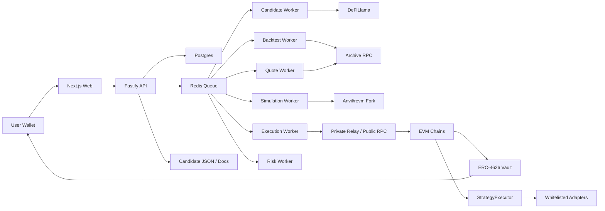

# 纯链上套利/高 APY 策略系统设计方案

日期：2026-07-03

目标目录：`/home/bumblebee/Project/on-chain-arbitrage`

## 1. 搜索结论

用户提出的三个硬要求是：

1. 纯链上：用户不注册交易所，只授权链上钱包即可开始自动化套利。
2. 年化收益确保 20% 以上，且稳定保持，不会过拟合。
3. 必要时扩大搜索范围。

结论必须诚实写清楚：目前公开可验证资料和本项目的实测结果，都不支持把“纯链上套利 + 对外开放用户 + 稳定保证 20%+ 年化”作为产品承诺。可以设计并实现一个纯链上、非托管、自动化策略平台，也可以把 20%+ 作为历史数据筛选门槛和上线前准入标准，但不能把它写成保证收益。

扩大搜索后，能进入系统候选池的模型分成两类：

| 类别                    | 是否纯链上 |   是否套利 | 20%+ 可作为承诺吗 | 结论                                         |
| ----------------------- | ---------: | ---------: | ----------------: | -------------------------------------------- |
| AMM 原子套利            |         是 |         是 |                否 | 可做，但竞争强，公开 RPC 很难稳定有 edge     |
| MEV/backrun 套利        |         是 |         是 |                否 | 需要私有订单流、低延迟、builder/relay 能力   |
| 清算/坏账套利           |         是 |     类套利 |                否 | Aave/Morpho/Compound 类，机会稀疏且竞争强    |
| 稳定币/挂钩资产偏离套利 |         是 |         是 |                否 | 可做，容量和窗口受市场状态限制               |
| CLMM/LP 做市            |         是 | 不是纯套利 |                否 | 可筛出 20%+ 历史 APY，但有无常损失和区间风险 |
| 收益轮动                |         是 |   不是套利 |                否 | 可作为资金管理模型，不应包装成套利           |

因此产品口径应改成：

- “纯链上自动化策略平台”
- “用户只连接钱包、授权和存入非托管金库”
- “候选策略需通过历史回测、样本外验证、容量测试、成本压力测试”
- “20%+ 是准入目标，不是承诺收益”

### 1.1 当前验证状态（2026-07-07）

系统已经把纯链上搜索扩展到 8 个家族、23 份 artifact、331 个候选，但通过“纯链上 + 不需要 CEX + 20%+ 年化净收益 + 稳定样本门槛”的候选仍然是 `0/5`。

2026-07-07 的公开资料复核和模型家族结论见 `docs/current-onchain-arbitrage-model-research-20260707.md`。

已覆盖家族：

- DEX quote replay：Base / Arbitrum / Polygon / Ethereum / Optimism / BNB AMM 路由扫描。
- Uniswap V3 cross-fee arbitrage：Base / Arbitrum / Ethereum / Polygon / Optimism / BNB 同交易对跨 fee tier 扫描。
- Curve stable arbitrage：Ethereum Curve stable pools 与 Uniswap V3 之间扫描。
- Balancer V2 arbitrage：Ethereum Balancer V2 Vault 与 Uniswap V3 之间扫描。
- Aave V3 liquidations：链上 debt-token 事件发现与 health factor 检查。
- Aave V3 liquidation event replay：Base / Ethereum `LiquidationCall` 历史事件回放；当前免费层 RPC 窗口内事件数为 0。
- Compound V3 liquidations：Comet 账户发现、`isLiquidatable` 与 `quoteCollateral` 检查；新增 `AbsorbCollateral` 历史事件回放 artifact，当前短窗口 RPC 探针事件数为 0。
- Morpho Blue liquidations：Morpho market/position 发现与 LLTV 风险门槛检查。

已完成 live interface：

- Web `/candidates` 可以展示多个模型家族。
- 用户可以输入钱包地址、资金量、滑点和 gas 上限，生成 dry-run execution plan。
- API 可以创建 live-run 记录并持久化 preflight / fork-simulation 结果。
- DEX、Uniswap V3 cross-fee、Curve、Balancer 四类 AMM 路线已经可以在 Anvil fork 上部署 fork-only `StrategyExecutor` 与 adapter，生成 `execute(...)` calldata，并验证净亏路线会 atomically revert。
- Aave、Compound、Morpho 清算类已接入 fork 级协议 gate：Aave 读取 Pool `getUserAccountData`，Compound 读取 Comet `isLiquidatable`，Morpho 读取 position / market / oracle price 并重算 LTV vs LLTV。当前候选均未通过协议清算门槛，因此仍不构建 liquidation / unwind calldata，也不开放实盘提交。

当前强制结论：

- `data/pure-arbitrage-search-overview.json`：`passingCount=0`，`liveExecutionStatus=blocked`。
- `data/pure-live-interface-smoke.json`：7 个家族接口通过，但真实执行仍 `blocked`。
- 任何 UI、API、文档和销售口径都不得承诺稳定 20%+ 年化。

## 2. 资料依据

本轮搜索和设计依据包括：

- DeFiLlama API 与 Yields 数据，用于候选池 APY/TVL 筛选：https://api-docs.defillama.com/ 与 https://defillama.com/yields
- Uniswap V3 流动性持仓管理，用于 CLMM mint/increase/decrease/collect 适配器：https://developers.uniswap.org/docs/protocols/v3/guides/managing-liquidity/mint-a-position
- Flashbots MEV-Share 套利教程，用于 backrun/flash-loan 模型结构：https://docs.flashbots.net/flashbots-mev-share/searchers/tutorials/flash-loan-arbitrage/introduction
- Balancer V2 Vault / batch swaps，用于 Vault 路由报价和结算：https://docs-v2.balancer.fi/reference/contracts/apis/vault.html 与 https://docs-v2.balancer.fi/reference/swaps/batch-swaps.html
- Balancer Flash Loans，用于原子套利资金来源设计：https://docs.balancer.fi/concepts/vault/flash-loans.html
- Aave V3 风险与清算机制，用于 liquidation 模型设计：https://aave.com/docs/aave-v3/overview 与 https://aave.com/help/borrowing/liquidations
- Compound III 清算机制，用于 `absorb` / collateral buyout 设计：https://docs.compound.finance/liquidation/
- Morpho Blue 市场与清算机制，用于 LLTV / liquidation 检查：https://docs.morpho.org/
- Curve 开发文档，用于 stable/peg 池与低滑点稳定资产模型：https://docs.curve.finance/
- Aerodrome Slipstream 合约地址与文档，用于 Base 上 CLMM 候选的执行计划：https://aerodrome.finance/security 与 https://aerodrome.finance/docs

## 3. 当前候选策略

当前系统通过 `scripts/search-high-apy-strategies.mjs` 拉取 DeFiLlama Yields，过滤出 5 个 20%+ 历史 APY 候选：

| ID                               | Chain    | Protocol             | Pair       | Classification | Live adapter               |
| -------------------------------- | -------- | -------------------- | ---------- | -------------- | -------------------------- |
| `candidate-1-base-usdc-cbbtc`    | Base     | Aerodrome Slipstream | USDC-CBBTC | LP 做市        | `aerodrome-slipstream-npm` |
| `candidate-2-ethereum-serv-weth` | Ethereum | Uniswap V3           | SERV-WETH  | LP 做市        | `uniswap-v3-npm`           |
| `candidate-3-ethereum-wtao-usdc` | Ethereum | Uniswap V3           | WTAO-USDC  | LP 做市        | `uniswap-v3-npm`           |
| `candidate-4-base-weth-usdc`     | Base     | Uniswap V3           | WETH-USDC  | LP 做市        | `uniswap-v3-npm`           |
| `candidate-5-base-eurc-usdc`     | Base     | Aerodrome Slipstream | EURC-USDC  | LP 做市        | `aerodrome-slipstream-npm` |

这些候选满足“链上、钱包即可参与、历史 APY 过滤超过 20%”的入口条件，但它们不是纯套利，也不能承诺稳定 20%。

## 4. 产品形态

用户视角：

1. 打开 Web 控制台。
2. 连接钱包。
3. 查看候选模型：纯套利、MEV、稳定币套利、清算、LP 做市、收益轮动。
4. 选择策略和资金量。
5. 查看历史回测、样本外验证、风险暴露、容量上限。
6. 点击 `Live plan` 生成 dry-run 执行计划。
7. 授权 ERC20 给策略金库或 Position Manager。
8. 存入 ERC-4626 金库。
9. 后端 worker 只在通过风控和 fork 模拟时执行。
10. 用户随时查看净值、PnL、持仓、执行记录、风险事件，并可撤回。

核心原则：

- 用户资金留在链上金库，不要求注册 CEX。
- 不保存用户私钥。
- 默认不让用户签危险的任意 calldata。
- 策略执行由白名单 adapter 和 RiskManager 限制。
- 所有收益展示必须区分历史、回测、样本外、实盘。

## 5. 模型设计

### 5.1 Atomic AMM Arbitrage

目标：在同一链、同一交易内，从 Balancer/Aave/自有库存拿资金，执行多跳 AMM 交换，最后归还资金并保留利润。

适配协议：

- Uniswap V2/V3/V4
- Aerodrome/Velodrome
- Curve StableSwap
- Balancer
- Maverick/Camelot 等

回测要求：

- 用历史 block state 重放 pool reserves、ticks、liquidity、gas。
- 计算 negative-log graph 最优环。
- 扣除 swap fee、gas、flash-loan fee、private relay tip。
- 进行容量测试：逐步放大下单量，直到利润变负。

实盘要求：

- 只接受 fork 模拟后仍盈利的机会。
- `minProfitAssets` 写入 calldata。
- `StrategyExecutor` 检查执行前后资产余额。
- 失败必须 revert。

### 5.2 MEV-Share Backrun

目标：监听私有/半私有订单流，在用户大额 swap 后 backrun，使价格回归并获利。

关键依赖：

- Flashbots MEV-Share 或 builder/relay 接入。
- 低延迟模拟。
- 私有 bundle 提交。

风险：

- 没有私有订单流时，公开 mempool 竞争极强。
- 机会不是稳定现金流。
- 对延迟、RPC、builder 覆盖率非常敏感。

### 5.3 Stable / Peg Arbitrage

目标：捕捉 USDC/EURC/DAI、wstETH/ETH、cbBTC/WBTC 等挂钩资产偏离，在 Curve/Uniswap/Balancer 等池子间套利。

特点：

- 通常滑点更低、方向更清晰。
- 极端行情中挂钩风险会放大。
- 必须限制单一资产、单一协议和单一挂钩风险。

### 5.4 Liquidation

目标：监控 Aave/Morpho/Compound 等借贷协议，当账户健康因子跌破清算线时，偿还债务并折价获得抵押品。

回测要求：

- 历史 oracle 价格。
- 借贷账户状态。
- close factor、liquidation bonus、gas、滑点。

实盘要求：

- 清算交易必须同交易完成抵押品换回基础资产。
- 未能覆盖 gas 和滑点时不执行。

### 5.5 CLMM LP Market Making

目标：不是纯套利，而是在 Uniswap V3/Aerodrome Slipstream 等集中流动性池中做区间 LP，赚交易费和激励。

为什么纳入：

- 当前最容易筛出 20%+ 历史 APY 候选。
- 完全链上，用户只需要钱包授权和存入。
- 能用执行计划清晰映射到 `mint` / `increaseLiquidity` / `decreaseLiquidity` / `collect`。

关键风险：

- 无常损失。
- 出区间导致资金闲置。
- 激励衰减。
- 再平衡成本。
- 小 TVL 池 APY 容易失真。

### 5.6 Yield Rotator

目标：在 Aave/Morpho/Curve/Pendle/稳定池之间做资金轮动，作为闲置资金管理模型。

注意：

- 这不是套利。
- 只能作为资金配置策略。
- 需设置协议白名单、TVL 下限、赎回流动性和 oracle 风险限制。

## 6. 系统架构



## 7. 后端模块

### API Gateway

当前已实现或设计的接口：

- `GET /api/strategy-candidates`
- `GET /api/strategy-candidates/artifact`
- `POST /api/strategy-candidates/:id/execution-plan`
- `POST /api/strategy-candidates/:id/live-runs`
- `GET /api/live/runs`
- `GET /api/live/runs/:id`
- `GET /api/live/runs/:id/preflight`
- `POST /api/backtests`
- `GET /api/backtests/:id`
- `GET /api/backtests/:id/events`
- `GET /api/vaults`
- `GET /api/vaults/:id`
- `GET /api/live/opportunities`
- `GET /api/live/executions`
- `POST /api/admin/strategies/:id/pause`
- `POST /api/admin/strategies/:id/resume`

新增执行计划接口返回：

- chainId
- adapter
- target contract
- required approvals
- transaction templates
- method selector
- risk limits
- preflight checks
- blockedBy
- warnings

### Workers

| Worker            | 职责                                              |
| ----------------- | ------------------------------------------------- |
| candidate-worker  | 刷新 DeFiLlama、协议 API、链上池数据              |
| indexer-worker    | 拉取 swap/mint/burn/collect/liquidation 事件      |
| backtest-worker   | 运行历史回测与 evidence backtest                  |
| quote-worker      | 实时计算 token split、slippage、gas、price impact |
| simulation-worker | fork 模拟 calldata，确认不会亏损                  |
| execution-worker  | 只提交通过风控的交易                              |
| risk-worker       | 暂停策略、触发退出、限制额度                      |
| accounting-worker | 计算 vault share price、PnL、fee accrual          |

## 8. 数据模型

建议保留/扩展以下表：

| 表                    | 用途                                              |
| --------------------- | ------------------------------------------------- |
| `strategies`          | 策略注册、状态、风险级别                          |
| `strategy_candidates` | 候选池快照                                        |
| `backtest_runs`       | 回测任务和结果                                    |
| `live_strategy_runs`  | 用户创建的实盘运行请求和计划快照                  |
| `live_run_preflights` | live run 的结构化 quote/simulation/preflight 报告 |
| `execution_plans`     | dry-run / ready / submitted 计划                  |
| `opportunities`       | 实时机会                                          |
| `simulations`         | fork 模拟结果                                     |
| `executions`          | 实盘交易记录                                      |
| `vaults`              | ERC-4626 金库                                     |
| `positions`           | LP NFT、借贷仓位、持仓                            |
| `pnl_ts`              | 日/小时级 PnL                                     |
| `risk_events`         | 风控事件                                          |
| `adapter_allowlist`   | 可调用 adapter 白名单                             |

## 9. 回测设计

回测分三层：

1. Evidence backtest：使用当前候选快照生成可审计的指标，适合快速展示。
2. Event replay backtest：重放历史 swap/mint/burn/collect/liquidation 事件，估算 fee、IL、滑点。
3. State/fork backtest：在关键 block 上 fork，模拟真实 calldata。

防过拟合规则：

- Walk-forward：训练窗口和验证窗口严格分离。
- Out-of-sample：策略参数只在训练段确定。
- Cost stress：gas、priority fee、滑点至少做 2x-5x 压力。
- Capacity stress：按资金规模递增，确认收益不会被容量吃掉。
- Regime split：牛市、熊市、高波动、低波动分段统计。
- Kill switch：样本外收益低于阈值或回撤超限自动暂停。

20%+ 准入应定义为：

```text
conservative_apy =
  min(
    out_of_sample_apy_after_cost,
    walk_forward_median_apy_after_cost,
    capacity_adjusted_apy_after_cost
  )

上线条件：
conservative_apy >= 20%
max_drawdown <= 策略阈值
min_tvl >= 策略阈值
simulated_loss_rate == 0
```

这仍然是上线条件，不是未来收益承诺。

## 10. 实盘执行设计

### 10.1 Dry-run Execution Plan

当前已实现：

```http
POST /api/strategy-candidates/:id/execution-plan
```

示例返回结构：

```json
{
  "mode": "dry-run",
  "status": "template-ready",
  "adapter": "uniswap-v3-npm",
  "targetContract": {
    "role": "Uniswap V3 NonfungiblePositionManager",
    "address": "0x03a520b32C04BF3bEEf7BEb72E919cf822Ed34f1"
  },
  "approvals": [],
  "transactions": [],
  "riskLimits": [],
  "blockedBy": []
}
```

当前 5 个候选的执行计划烟测结果：

```text
candidate-1-base-usdc-cbbtc | template-ready | aerodrome-slipstream-npm | 0x827922686190790b37229fd06084350E74485b72
candidate-2-ethereum-serv-weth | template-ready | uniswap-v3-npm | 0xC36442b4a4522E871399CD717aBDD847Ab11FE88
candidate-3-ethereum-wtao-usdc | template-ready | uniswap-v3-npm | 0xC36442b4a4522E871399CD717aBDD847Ab11FE88
candidate-4-base-weth-usdc | template-ready | uniswap-v3-npm | 0x03a520b32C04BF3bEEf7BEb72E919cf822Ed34f1
candidate-5-base-eurc-usdc | template-ready | aerodrome-slipstream-npm | 0x827922686190790b37229fd06084350E74485b72
```

### 10.2 从 dry-run 到 live

当前已实现第一段 live run 状态机：

```http
POST /api/strategy-candidates/:id/live-runs
GET /api/live/runs
GET /api/live/runs/:id
```

用户输入钱包地址和资金量后，API 会：

1. 重新生成候选策略执行计划。
2. 写入 `live_strategy_runs`，初始状态为 `queued`。
3. 保存 plan、risk limits、blockedBy 和用户资金量。

worker 会：

1. 轮询 `queued` live runs。
2. 将 run 标记为 `preflight`。
3. 生成结构化 `live_run_preflights` 报告，包含 checks、quote、execution、nextActions、blockers。
4. 使用 DeFiLlama token price 为 LP 候选生成 price-driven partial quote：按资金 USD 价值拆分 token0/token1，并计算 desired/min amount。
5. 对 Uniswap V3 候选使用 factory `getPool` 解析池地址，并读取 `slot0` / `liquidity`。
6. 如果 price-impact quote、gas estimate、fork simulation、production adapter 还未满足，就标记为 `blocked`。
7. 写入 `risk_events`，方便前端和运维审计。

2026-07-03 已验证：

```text
created | 7b8f41e8-2060-4e99-b8d5-0c82b412d5db | queued | candidate-4-base-weth-usdc | uniswap-v3-npm
7b8f41e8-2060-4e99-b8d5-0c82b412d5db | candidate-4-base-weth-usdc | blocked | blockers=10
risk_events=1
```

结构化 preflight 报告也已验证：

```text
preflight=blocked checks=7 quote=missing calldataReady=false
api-run=d2d78e21-2856-482a-aabc-730fbb149d3c status=blocked latestPreflight=true
api-preflight=blocked checks=7 quote=missing
```

价格驱动的 partial quote 已验证：

```text
preflight=blocked checks=7 quote=partial prices=2
EURC price=1.1450724942731076 desired=2183.2678826 min=2175.62644502
USDC price=0.9998525401773796 desired=2500.36870393 min=2491.61741346
```

Base Uniswap V3 池状态读取已验证：

```text
poolState=ready pool=0xd0b53d9277642d899df5c87a3966a349a798f224 fee=500 tick=-201837 liquidity=893280586952902821
required=price impact|gas estimate
```

Base Uniswap V3 mint 参数预览已验证。worker 会从当前 price-driven quote、池子 tick/fee、token decimals 生成只读 `mintPreview`，包括 tick 区间、base-unit desired/min、selector、deadline 和 recipient。该结果不是可签名 calldata，仍然被后续执行门禁阻断。

```text
run=da0bbf60-4912-4c08-9a7e-9fae5f460b6e status=blocked blockers=10
preflight=blocked checks=9 quote=partial poolState=ready mintPreview=ready
pool=0xd0b53d9277642d899df5c87a3966a349a798f224 fee=500 tick=-201855
ticks=-202460..-201250 spacing=10
selector=0x88316456 recipient=0x000000000000000000000000000000000000dead
WETH decimals=18/config desired=2916173150000000103 min=2901592280000000024
USDC decimals=6/config desired=5000815029 min=4975810954
```

Base Uniswap V3 transaction preview 已验证。worker 会从 `mintPreview` 派生两笔 ERC20 `approve` calldata preview 和一笔 Uniswap V3 `mint` calldata preview；前端只展示为只读检查材料，系统仍然保持 blocked。

```text
run=434bdd88-2e74-4a3a-8703-77be070a31c8 status=blocked blockers=10
preflight=blocked checks=10 quote=partial poolState=ready mintPreview=ready transactionPreview=ready
calls=3
approval|Approve WETH|selector=0x095ea7b3|bytes=68
approval|Approve USDC|selector=0x095ea7b3|bytes=68
position-mint|Mint Uniswap V3 position|selector=0x88316456|bytes=356
```

Base Uniswap V3 wallet preflight 已验证。worker 会读取 `balanceOf(wallet)` 和 `allowance(wallet, positionManager)`。烟测钱包 WETH/USDC 余额足够，但 allowance 为 0，因此系统正确返回 `walletPreflight=needs-approval`，并给出每个 token 的 approval gap。

```text
run=aa6f5c15-657d-4f39-8960-409ffdaadb05 status=blocked blockers=10
preflight=blocked checks=11 quote=partial poolState=ready mintPreview=ready transactionPreview=ready walletPreflight=needs-approval
walletTokens=2
WETH|required=2914949969999999890|balance=4000730097722157130|balanceOk=true|allowance=0|allowanceOk=false|approvalGap=2914949969999999890
USDC|required=5000638956|balance=25650912228|balanceOk=true|allowance=0|allowanceOk=false|approvalGap=5000638956
```

`/candidates` live run 面板现在可以对 `approval` 类型的 transaction preview 调用 `eth_sendTransaction`，也会在发送前检查/切换钱包 chainId。Uniswap V3 `mint` 调用仍然保持锁定，必须等 gas estimate、fork simulation 和风险门禁通过后才能开放。

必须补齐以下步骤后才能打开实盘：

1. Quote worker 用池子 tick/liquidity 计算真实 price impact，而不是只按外部价格拆分资金。
2. 读取池子当前 tick、sqrtPrice、liquidity、tickSpacing/fee tier。
3. 根据策略参数选择 tickLower/tickUpper，并通过波动率/容量约束校验。
4. 用真实 quote 更新 amount0Min/amount1Min，并检查 calldata preview 与 ABI/fork 结果一致。
5. 增加 gas estimate 和 fork 模拟完整 approve/mint/increase/decrease/collect/rebalance。
6. RiskManager 检查 max position、max slippage、max gas、max IL、cooldown。
7. 只允许白名单 adapter 调用。
8. 交易执行后写入 accounting。

## 11. 前端设计

页面：

| 页面              | 功能                                                 |
| ----------------- | ---------------------------------------------------- |
| `/`               | 总览、资金、收益、风险状态                           |
| `/candidates`     | 20%+ 候选池、evidence backtest、live plan、start run |
| `/strategies`     | 模型列表和状态                                       |
| `/strategies/:id` | 模型参数、回测、风险                                 |
| `/backtests/new`  | 新建回测                                             |
| `/backtests/:id`  | 回测结果和指标                                       |
| `/vaults`         | 金库列表                                             |
| `/vaults/:id`     | 钱包 approve/deposit/withdraw                        |
| `/live`           | 机会、执行、模拟状态                                 |
| `/risk`           | 风控事件、暂停/恢复                                  |
| `/settings`       | RPC、API key、管理员配置                             |

候选页当前已具备：

- 展示 5 个候选。
- 输入资金量。
- 发起 evidence backtest。
- 生成 dry-run live execution plan。
- 创建 live run request。
- 展示 approvals、target contract、transaction params、risk limits、blockedBy、warnings。
- 展示 quote、pool state、mint preview、transaction preview、wallet balance/allowance preflight。
- 展示 injected-wallet 状态面板，读取 `eth_accounts` / `eth_chainId`，监听账户和链切换，并提供显式 `Connect wallet` 操作。
- 对 approval preview call 发起钱包签名交易；mint/rebalance 仍被门禁锁定。

## 12. 合约设计

核心合约：

- `ArbVault`：ERC-4626 金库，用户 deposit/withdraw。
- `StrategyController`：策略状态、额度、白名单。
- `StrategyExecutor`：执行入口，检查利润和余额变化。
- `RiskManager`：风控阈值、暂停、每日限额。
- `Accounting`：净值、费用、收益分配。
- `Adapters`：
  - `UniswapV3Adapter`
  - `AerodromeSlipstreamAdapter`
  - `CurveAdapter`
  - `BalancerFlashLoanAdapter`
  - `AaveLiquidationAdapter`

安全要求：

- 禁止任意外部 call。
- adapter 白名单。
- before/after balance 校验。
- minProfit/minShares/minAmountOut 写入 calldata。
- 不支持 fee-on-transfer/rebase/blacklist token，除非专门审计。
- 管理员权限走 timelock + multisig。
- 上线前必须审计。

## 13. 风控

每个策略必须配置：

- 单策略最大 TVL。
- 单池最大 TVL 占比。
- 单交易最大 gas。
- 单交易最大滑点。
- 最大日亏损。
- 最大回撤。
- 最大再平衡频率。
- oracle 偏离阈值。
- APY 衰减暂停阈值。
- TVL/volume 下降暂停阈值。

用户界面必须展示：

- 历史 APY。
- 样本外 APY。
- 真实实盘 APY。
- 最大回撤。
- 当前持仓。
- 风险事件。
- 是否纯套利。
- 是否使用 LP/做市/收益轮动。

## 14. 当前仓库状态

当前已经落到代码的内容：

- `scripts/search-high-apy-strategies.mjs`
- `data/strategy-candidates.json`
- `docs/current-20apy-candidates.md`
- `docs/current-runbook-20260703.md`
- `apps/api/src/candidates.ts`
- `apps/api/src/executionPlans.ts`
- `infra/db/migrations/postgres/003_live_strategy_runs.sql`
- `infra/db/migrations/postgres/004_live_run_preflights.sql`
- `scripts/migrate-postgres.mjs`
- `GET /api/strategy-candidates`
- `GET /api/strategy-candidates/artifact`
- `POST /api/strategy-candidates/:id/execution-plan`
- `POST /api/strategy-candidates/:id/live-runs`
- `GET /api/live/runs`
- `GET /api/live/runs/:id`
- `GET /api/live/runs/:id/preflight`
- `apps/web/src/app/candidates/page.tsx`
- `apps/workers` evidence backtest 处理
- `apps/workers` live run preflight 处理
- `packages/strategy-models` LP/yield 模型注册

已验证：

- API TypeScript check 通过。
- Web TypeScript check 通过。
- Workers TypeScript check 通过。
- 新执行计划接口 5 个候选烟测通过。
- live run 创建、查询、worker preflight blocked、risk_events 写入烟测通过。
- structured live run preflight report 生成和 API 查询烟测通过。
- DeFiLlama price-driven partial quote 生成和 API 查询烟测通过。
- Base Uniswap V3 factory getPool + slot0/liquidity pool-state resolver 烟测通过。
- Base Uniswap V3 read-only mint parameter preview 烟测通过。
- Base Uniswap V3 read-only transaction calldata preview 烟测通过。
- Base Uniswap V3 wallet balance/allowance preflight 烟测通过。
- 之前 Rust、Foundry、workers、strategy models checks 已通过。

## 15. 分阶段路线

### Phase 0：诚实 MVP

已基本完成：

- 候选池搜索。
- 5 个高 APY 候选展示。
- evidence backtest。
- dry-run execution plan。
- live run request。
- worker preflight blocked gate。
- 钱包 approve + ERC-4626 deposit。

### Phase 1：可回测

下一步：

- 真实事件索引。
- LP fee accrual 重放。
- IL 计算。
- gas/slippage/capacity stress。
- backtest report UI。

### Phase 2：可模拟

下一步：

- Uniswap V3 adapter fork test。
- Aerodrome Slipstream adapter fork test。
- Curve adapter fork test。
- Balancer flash loan adapter fork test。
- Aave liquidation adapter fork test。

### Phase 3：小资金实盘

下一步：

- 部署 Base/Ethereum 金库。
- 真实 vault 注册。
- 单策略额度限制。
- 私有 relay/public RPC 双通道。
- 每笔交易必须 fork 模拟。
- 只允许白名单策略。

### Phase 4：对外开放

上线前必须：

- 第三方审计。
- 法律合规评估。
- 30 天以上小资金实盘数据。
- 公开风险披露。
- 收益展示禁止“保证”措辞。
- 建立应急暂停和资金退出流程。

## 16. 最终建议

不要把产品定义为“保证 20%+ 年化的纯链上套利”。这在工程、市场竞争和合规上都不可持续。

建议定义为：

> 一个非托管的链上策略平台，用户只需连接钱包和授权金库。系统持续搜索套利、清算、挂钩偏离、LP 做市和收益轮动机会，并只让通过回测、样本外验证、容量测试、fork 模拟和风控的策略进入实盘。

这样既符合“用户不需要交易所”的产品目标，也不会因为无法证明的收益承诺把系统做成高风险误导产品。

## 17. 2026-07-06 搜索与事件回放补充

### 17.1 搜索结论

继续扩大搜索后，仍然没有足够证据支持“5 个纯链上、无需 CEX、对公开用户稳定/保证 20%+ 年化”的套利模型。

当前可研究的纯链上模型包括：

| 模型 | 是否纯链上 | 是否需要交易所 | 是否可承诺稳定 20%+ | 结论 |
| --- | --- | --- | --- | --- |
| DEX-DEX flash arbitrage | 是 | 否 | 否 | 竞争极强，机会转瞬即逝，需要私有 orderflow/searcher 基建 |
| Aave/Balancer flash-loan arbitrage | 是 | 否 | 否 | 是资金原语，不是收益保证；必须覆盖手续费、滑点、gas、竞争 |
| 稳定币/挂钩偏离套利 | 是 | 否 | 否 | 事件驱动、容量有限、尾部风险明显 |
| 借贷清算 | 是 | 否 | 否 | 真实链上策略，但收益离散、依赖市场波动和清算队列竞争 |
| 跨链/库存套利 | 部分 | 否 | 否 | 非完全原子，存在桥、库存、最终性和再平衡风险 |
| 集中流动性 LP 做市 | 是 | 否 | 否，且不是纯套利 | 可观察到高 fee APY，但存在 IL、出区间和再平衡成本 |

参考来源：

- Uniswap concentrated liquidity: https://docs.uniswap.org/concepts/protocol/concentrated-liquidity
- Uniswap fees: https://docs.uniswap.org/concepts/protocol/fees
- Uniswap v3 flash integrations: https://docs.uniswap.org/contracts/v3/guides/flash-integrations/inheritance-constructors
- Aave V3 flash loans: https://aave.com/docs/aave-v3/guides/flash-loans
- Balancer flash loans: https://docs.balancer.fi/concepts/vault/flash-loans.html
- Flashbots public simple arbitrage example: https://github.com/flashbots/simple-arbitrage
- DeFiLlama Yields API: https://yields.llama.fi/pools

### 17.2 已实现的事件回放证据层

新增脚本：

```bash
scripts/replay-uniswap-v3-lp-fees.mjs
```

当前支持：

- `candidate-4-base-weth-usdc`
- Base Uniswap V3 WETH/USDC 0.05%
- pool: `0xd0b53d9277642d899df5c87a3966a349a798f224`
- token0: WETH `0x4200000000000000000000000000000000000006`
- token1: USDC `0x833589fcd6edb6e08f4c7c32d4f71b54bda02913`

脚本会读取 Base RPC 的真实 `Swap` logs，估算：

- pool 总手续费
- 假设 LP 仓位的 active liquidity share
- 仓位可分到的 WETH/USDC 手续费
- 固定 tick range 下期初/期末 LP 价值
- 相比持币的 IL
- gas 成本假设
- gross fee APY、IL APY、gas APY、net APY

当前 artifact：

```text
data/event-replay-candidate-4-base-weth-usdc.json
durationDays=0.0115509259
swapCount=166
netApyPct=28.3168
gate=block
evidenceStatus=net-apy-observed-but-sample-too-short-or-thin
```

解释：短窗口年化净 APY 看起来超过 20%，但样本只有约 16.6 分钟，所以系统继续阻塞 `profitability-backtest`。这不是失败，而是风控正确工作。

### 17.3 API 和前端接入

新增：

- `GET /api/strategy-candidates/:id/event-replay`
- `GET /api/live/runs/:id` 返回 `event_replay_evidence`
- `readiness.gates[]` 中 `profitability-backtest` 读取 event replay artifact
- `/candidates` live run panel 展示 replay window、fees、IL、gas、net APY、gate 和 caveats

最新 smoke：

```text
eventReplay=block replayNetApy=28.31681608460301 profitabilityGate=block
readiness=blocked blockers=3 forkGate=pass
forkSimulation=passed calls=3 totalGasUsed=534257 failedKind=none failedStatus=none failedError=none
```

因此当前系统状态是：可搜索、可展示、可生成 live plan、可预检、可 fork 模拟、可展示真实短窗口 LP event replay，但仍不可作为“稳定 20%+ 纯套利自动执行产品”对外开放。
